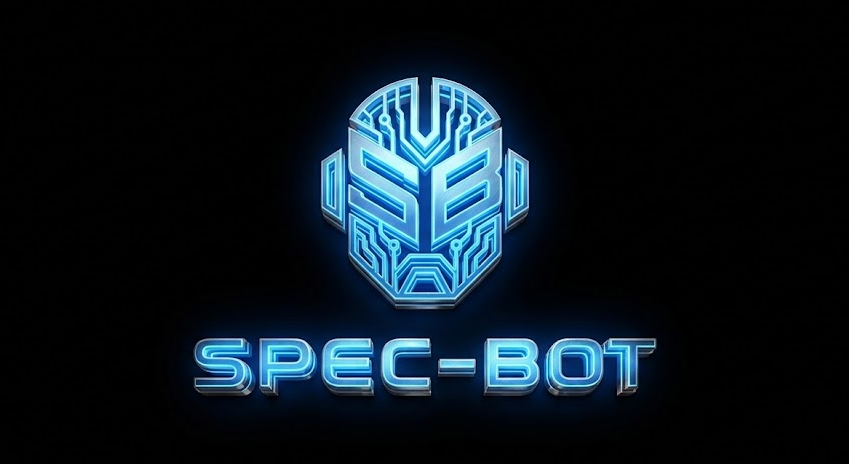

<p align="center">
  
</p>

<p align="center">
  <strong>Spec-bot</strong> — Workflow templates for AI-orchestrated development
</p>

<p align="center">
  
  
  
</p>

---

# Spec-bot

Spec-bot is a workflow orchestration tool designed to provide a structured, professional **Software Development Life Cycle (SDLC)** for AI-assisted coding.

Instead of providing the AI with fragmented instructions, Spec-bot establishes a standardized "source of truth" and a step-by-step pipeline that ensures consistency, quality, and progress tracking across the entire development process.

## 🧠 The Core Philosophy: "AI-First SDLC"

Most AI tools (Cursor, Claude, Copilot) are powerful but often lack a cohesive long-term memory or a structured plan for complex projects. Spec-bot solves this by:

1.  **Standardizing Context:** It creates a dedicated `spec-bot/` directory that acts as the project's brain.
2.  **Defining the Path:** It provides clear Markdown-based workflow templates that the AI reads to understand exactly what step it is in.
3.  **Tracking Progress:** It uses a `state.json` file to maintain a machine-readable record of features, tasks, and test results.

---

## 📦 Install

```bash
npm install -g spec-bot
```

Requires **Node.js 18+**.

---

## 🚀 Quick start

```bash
# In your project directory
spec-bot init
```

Choose your AI tool (Cursor, Claude, GitHub Copilot, or .agent). The CLI copies templates into e.g. `.cursor/` and `spec-bot/`. Your AI reads those files to run the workflow.

```bash
spec-bot generate    # Copy templates again (refresh from package)
```

---

## 🛠 How it Works

Spec-bot is a **CLI that sets the stage for the AI to perform**.

1.  **Initialization:** The developer runs `spec-bot init`. This copies specialized templates into the project.
2.  **AI Orchestration:** The developer interacts with their AI agent. The AI reads the Spec-bot rules and knows how to use the available "commands" (Markdown prompts) to move the project through the pipeline.
3.  **Execution:** The AI, not the CLI, performs the heavy lifting: planning the product, breaking down features, writing the code, and validating the results.

### The Spec-bot Pipeline

The tool enforces a logical flow from concept to completion:

*   **Planning:** Define the Mission, Roadmap, and Tech Stack.
*   **Features:** Break the roadmap into concrete, high-level features.
*   **Tasks:** Decompose features into implementable, testable units of work.
*   **Implementing:** Build the project structure and implement tasks one by one.
*   **QA & Validation:** Verify each task with tests and perform final end-to-end validation.

---

## 📋 Commands

| Command | Description |
|--------|-------------|
| `spec-bot init` | Select AI tool and copy templates (e.g. `.cursor` + `spec-bot/`) |
| `spec-bot generate` | Copy templates again (uses `.spec-bot.json` or `--tool`) |

> **Note:** There are no `plan`, `features`, or `task` commands in the CLI — the **AI** performs those actions using the workflow templates.

---

## 📁 What gets copied

- **For Cursor:** `.cursor/rules/` (workflow rule) and `.cursor/commands/spec-bot/` with specialized prompts for planning, implementation, and standards management.
- **For all tools:** `spec-bot/` with:
  - `product/`: `mission.md`, `roadmap.md`, `tech-stack.md`.
  - `specs/`: Detailed implementation plans.
  - `standards/`: Project-specific coding standards.
  - `state.json`: The machine-readable source of truth for the AI.
  - `WORKFLOW.md`: Detailed reference for the entire process.

---

## 🛠 Development

```bash
git clone https://github.com/waleedahmad-dev/spec-bot.git
cd spec-bot
npm install
npm run build
node dist/cli.js --help
```

---

## 📄 License

**MIT** — see [LICENSE](LICENSE).

---

## 🤝 Contributing

See [CODE_OF_CONDUCT.md](CODE_OF_CONDUCT.md) and [CONTRIBUTING.md](CONTRIBUTING.md).  
Issues and PRs: [github.com/waleedahmad-dev/spec-bot](https://github.com/waleedahmad-dev/spec-bot).
